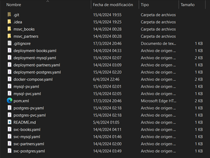

# Microservicio "library"
## Ejecución usando Docker, Kubernetes y Minikube

## Autor: Rafael Enrique Cortez

***
## Explicación del proyecto

**Proyecto Maven** cuyo dominio a tratar es de una librería, préstamo de libros a socios, contiene dos microservicios
desarrollados con **Java 17** y **Spring Boot 3**.
- **Microservicio de Socios (msvc_partners):** Manejo de socios y registro de los préstamos de libros realizados.
  Interactúa con una base de datos MySQL.
- **Microservicio de Libros (msvc_books):** Relación entre libros y autores, así como también el stock de libros.
  Interactúa con una base de datos PostgreSQL.

- Ademas para el proyecto se usó:
  - Spring Data JPA
  - Base de datos MySQL y H2 para test
  - Pruebas Unitarias con JUnit5 y Mockit (de momento solo en msvc_books para repository, service y controller).
  - Lombok
  - Maven
  - DTO
  - Manejo de excepciones globales: paquete exception
  - Programacion Funcional, API Stream, lambda.
  - Comunicación entre microservicios mediante openfeign.
  - Genericos: IGenericCRUD, IGenericCRUDImpl, IGenericRepository.

***
## Aclaraciones generales
- Solución de errores
  - Al estar trabajando en Windows y las imágenes ser en Linux tenía un error al crearlas, es por eso que en los
  Dockerfile puede ver la siguiente línea:
      - `RUN sed -i 's/\r$//' mvnw`
  - Para evitar problemas de permisos al ejecutar en entornos distintos a Windows:
    - `RUN chmod +x mvnw`
- Servicio LoadBalancer los tenemos presentes en svc-partners.yaml y svc-books.yaml
***
## Preparando el entorno de ejecución con Minikube
Ir al repositorio de GitHub y descargar la rama **kubernetes_project**.
> https://github.com/RafaelJUY/library/tree/kubernetes_project

Se va a encontrar con la siguiente estructura (llamada desde ahora **raíz del proyecto**):

### Ejecutamos los siguientes comandos
- `minikube start`
- `minikube status`

### Mostrando punto de partida.
Observamos que de nuestra aplicación no tenemos **Deployments, Pods, Services, Persistent
Volume (pv) ni Persistent Volume Claim (pvc)**

Ejecutaremos algunos comandos (posicionados sobre la carpeta raíz del proyecto) para crear los siguientes objetos.

### Creando Objetos de Kubernetes
- #### Relacionado a la Base de datos y la persistencia

  1. PersistentVolume
     - `kubectl apply -f .\mysql-pv.yaml -f .\postgres-pv.yaml`

  2. PersistentVolumeClaim
     - `kubectl apply -f .\mysql-pvc.yaml -f .\postgres-pvc.yaml`

  3. Deployment de MySQL y PostgreSQL
     - `kubectl apply -f .\deployment-mysql.yaml -f .\deployment-postgres.yaml`

  4. Servicios de Mysql y PostgresSQL
     - `kubectl apply -f .\svc-mysql.yaml -f .\svc-postgres.yaml`

  5. Opcionalmente: Si queremos podemos comprobar el estado de los Pods para ver si las Base de Datos están listas para
     recibir consultas.
     - `kubectl get pods`
     - `kubectl logs NOMBRE-POD`

- #### Relacionado a los microservicios de partners y books
  1. Deployment de partners y books
      - `kubectl apply -f .\deployment-partners.yaml -f .\deployment-books.yaml`

  2. Servicios de Partners y books
     - `kubectl apply -f .\svc-partners.yaml -f .\svc-books.yaml`

### Podemos ver el estado final con todos los objetos creados. 
Podemos observar que contamos con **Deployments, Pods, Services, Persistent Volume (pv) y Persistent Volume Claim (pvc)**:

### Antes de probar la aplicación
Si bien ya tenemos todos lo objetos creados cuando ejecutamos en la captura anterior `kubectl get all` se podía notar
que los servicios de tipo **LoadBalancer** tienen `pending` en la `EXTERNAL-IP`. También podemos verlo con el siguiente
comando.
- `kubectl get services`

Esto se debe al no estar usando un proveedor Cloud. Para poder hacer nuestras pruebas necesitaremos generar mediante un
comando de minikube la IP externa. El comando es el siguiente:
- `minikube service msvc-partners –url`
- `minikube service msvc-books –url`

#### Probar aplicacion con Postman
En la carpeta recursos puede encontrar un archivo **Project_Library.postman_collection.json**
donde exporté los end-point, **puede importarlos en su Postman** para no tener que crear desde cero sus consultas a la
aplicación.

Hay que tener en cuenta que las IP externas generadas por los últimos dos comandos ejecutados **NO son siempre las mismas**,
es por esto que el archivo Project_Library.postman_collection.json no las tiene hardcodeadas. Para poder hacer las
pruebas se sugiere:
- Suponiendo que la URL del PostMan son las siguientes:
    - `localhost:8002/api/partners`
    - `localhost:8001/api/books`
- Remplazar hasta /api/… por la IP externa generada por minikube:
  - `http://192.168.69.74:31148/api/partners`
  - `http://192.168.69.74:31571/api/books`

En este momento ya podremos hacer algunas peticiones con Postman.

***
## Probando la aplicación

Podemos crear un autor 

- `[POST] http://192.168.72.114:31571/api/authors`

Crear un libro

- `[POST] http://192.168.72.114:31571/api/books`

Asociar el libro con su autor

- `[PUT] http://192.168.72.114:31571/api/books/assign-authors/{ID-LIBRO}?idsAuthors={ID-AUTOR}`

Buscar el libro por id

- `[GET] http://192.168.72.114:31571/api/books/{ID-LIBRO}`

Crear un socio

- `[POST] http://192.168.72.114:30905/api/partners`

Prestar un libro

- `[PUT] http://192.168.72.114:30905/api/partners/register-loan/{ID-SOCIO}/{ID-LIBRO}`

Buscar el socio donde observaremos el libro prestado

- `[GET] http://192.168.72.114:30905/api/partners/{ID-SOCIO}`