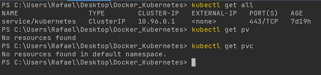
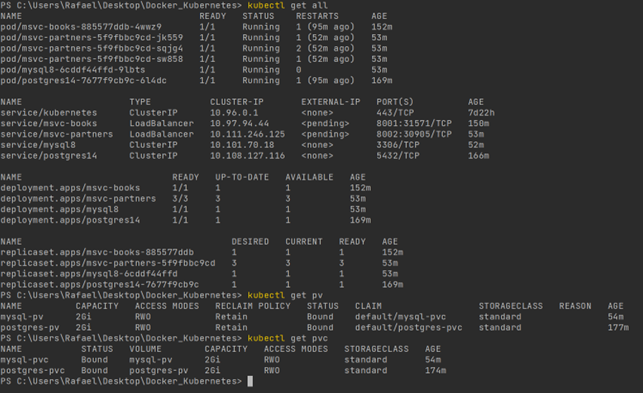
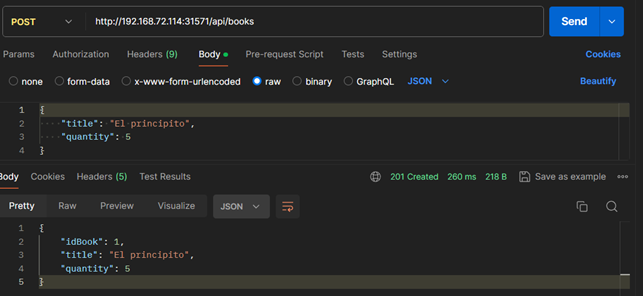
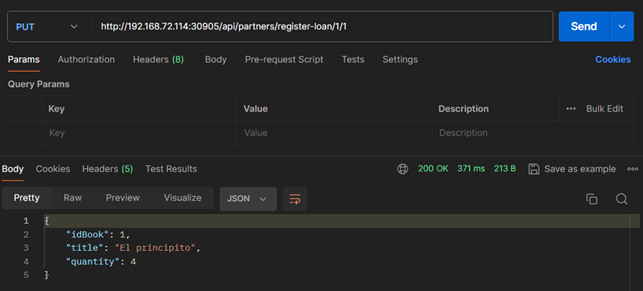
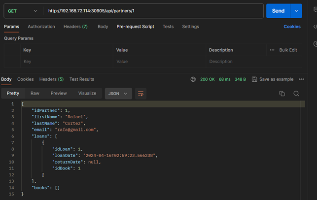

# Microservicio "library"

## Ejecución usando Docker y Docker-Compose

## Autor: Rafael Enrique Cortez

***

## Explicación del proyecto

**Proyecto Maven** cuyo dominio a tratar es de una librería, préstamo de libros a socios, contiene dos microservicios
desarrollados con **Java 17** y **Spring Boot 3**.

- **Microservicio de Socios (msvc_partners):** Manejo de socios y registro de los préstamos de libros realizados.
  Interactúa con una base de datos MySQL.
- **Microservicio de Libros (msvc_books):** Relación entre libros y autores, así como también el stock de libros.
  Interactúa con una base de datos PostgreSQL.

- Además, para el proyecto se usó:
    - Spring Data JPA
    - Base de datos MySQL y H2 para test
    - Pruebas Unitarias con JUnit5 y Mockit (de momento solo en msvc_books para repository, service y controller).
    - Lombok
    - Maven
    - DTO
    - Manejo de excepciones globales: paquete exception
    - Programacion Funcional, API Stream, lambda.
    - Comunicación entre microservicios mediante openfeign.
    - Genericos: IGenericCRUD, IGenericCRUDImpl, IGenericRepository.

***

## Aclaraciones generales

- Solución de errores
    - Al estar trabajando en Windows y las imágenes ser en Linux tenía un error al crearlas, es por eso que en los
      Dockerfile puede ver la siguiente línea:
        - `RUN sed -i 's/\r$//' mvnw`
    - Para evitar problemas de permisos al ejecutar en entornos distintos a Windows:
        - `RUN chmod +x mvnw`
    - Al tener en mi maquina MySQL y PostgreSQL, al momento de hacer el enlace de puertos no podía usar los puertos por
      defecto de dichas Bases de Datos, 3306 y 5432. Es por eso que se enlazan al puerto externo +1, es decir 3307 y
      5433 respectivamente.

***

## Preparando el entorno de ejecución con Docker-Compose

Ir al repositorio de GitHub y descargar la rama **docker-compose**.
> https://github.com/RafaelJUY/library/tree/docker-compose

Se va a encontrar con la siguiente estructura (llamada desde ahora **raíz del proyecto**):

Podemos observar que en la raíz del proyecto tenemos el archivo **docker-compose.yaml** y además tendremos en **msvc_books** y
**msvc_partners** los **Dockerfile**.

En total son cuatro imágenes que tendremos en el docker-compose:

- msvc-partners
- msvc-books
- MySQL (usa el volumen data-mysql)
- PostgreSQL (usa el volumen data-postgres)

### Mostrando punto de partida.

Mostrando punto de partida, observamos que no tenemos **imágenes, contenedores, volúmenes ni redes** creadas.

### Levantando la aplicación

Ejecutaremos algunos comandos (posicionados sobre la carpeta raíz del proyecto) para crear los siguientes objetos.

Estando en la raíz del proyecto ejecutamos:
`docker-compose up -d`

Al finalizar:

### Podemos ver el estado final con todos los objetos creados.

Podemos observar que contamos con **imágenes, contenedores, volúmenes y redes**

***

## Probando la aplicación

### Probar aplicacion con Postman

> En la carpeta **resources/test-postman** puede encontrar un archivo **Project_Library.postman_collection.json**
donde exporté los end-point, **puede importarlos en su Postman** para no tener que crear desde cero sus consultas a la
aplicación.

En este momento ya podremos hacer algunas peticiones con Postman.

Podemos crear un autor

- `[POST] localhost:8001/api/authors`

Crear un libro

- `[POST] localhost:8001/api/books`

Asociar el libro con su autor

- `[PUT] localhost:8001/api/books/assign-authors/{ID-LIBRO}?idsAuthors={ID-AUTOR}`

Buscar el libro por ID

- `[GET] localhost:8001/api/books/{ID-LIBRO}`

Crear un socio

- `[POST] localhost:8002/api/partners`

Prestar un libro

- `[PUT] localhost:8002/api/partners/register-loan/{ID-SOCIO}/{ID-LIBRO}`

Buscar el socio donde observaremos el libro prestado

- `[GET] localhost:8002/api/partners/{ID-SOCIO}`

***

## Preparando el entorno de ejecución sin Docker-Compose

> **Este apartado no es necesario hacerlo, el objetivo es mostrar la diferencia si no estuvieramos usando Docker-Compose.**

Se usa la siguiente network **spring**para los contenedores:

- `docker network create spring`

Para las Bases de Datos

- MySQL
    - `docker run -d -p 3307:3306 --name mysql8 --network spring -e MYSQL_ROOT_PASSWORD=rafael -e MYSQL_DATABASE=msvc_partners -v data-mysql:/var/lib/mysql mysql:8`
- PostgreSQL
    - `docker run -p 5433:5432 --name postgres14 --network spring -e POSTGRES_PASSWORD=rafael -e POSTGRES_DB=msvc_books -d -v data-postgres:/var/lib/postgresql/data postgres:14-alpine`

Para los microservicios

**IMPORTANTE** estar posicionado en la raíz del proyecto. Además, es necesario que los contenedores de MySQL y
PostgreSQL
estén ejecutándose, de lo contrario los microservicios no podrán conectarse a la BD y se van a detener.

- Microservicio partners:
    - `docker build -t partners . -f .\msvc_partners\Dockerfile`
    - `docker run -d -p 8002:8002 --env-file .\msvc_partners\.env --rm --name msvc-partners --network spring partners`
- Microservicio books
    - `docker build -t books . -f .\msvc_books\Dockerfile`
    - `docker run -p 8001:8001 --env-file .\msvc_books\.env -d --rm --name msvc-books --network spring books`

Las imágenes también las podría obtener del DockerHub

- `docker pull rafaeljuy/books`
- `docker pull rafaeljuy/partners`
